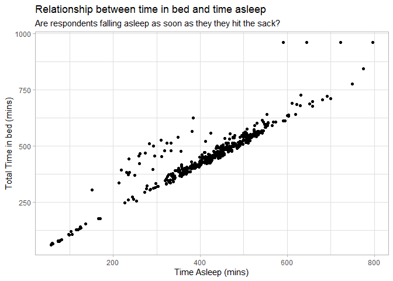
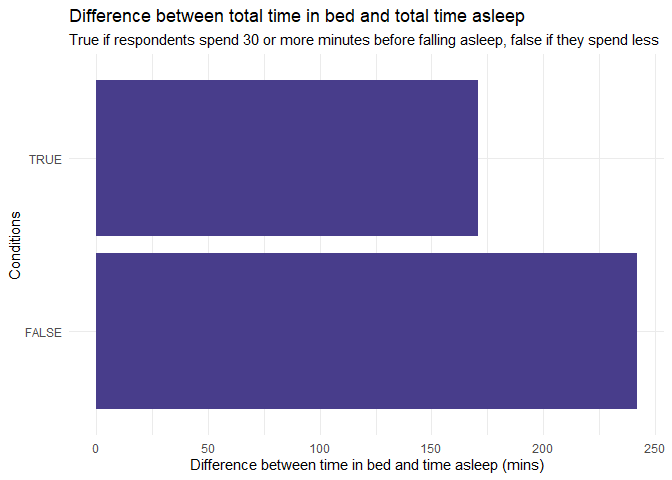
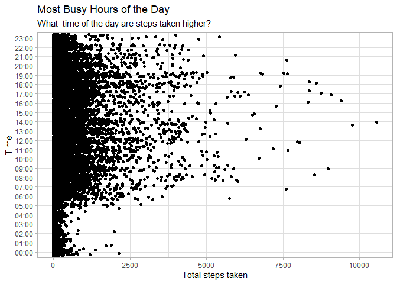
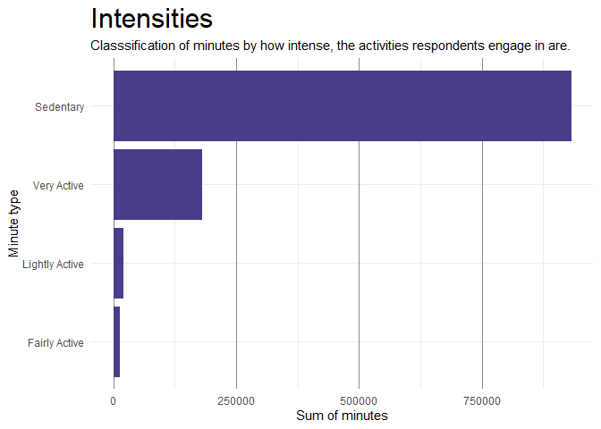
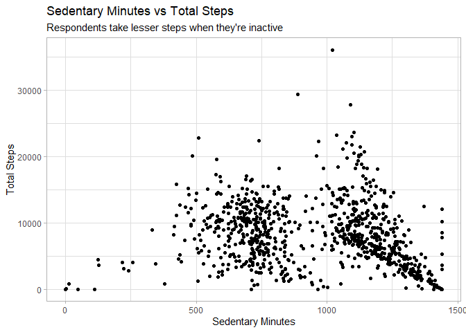
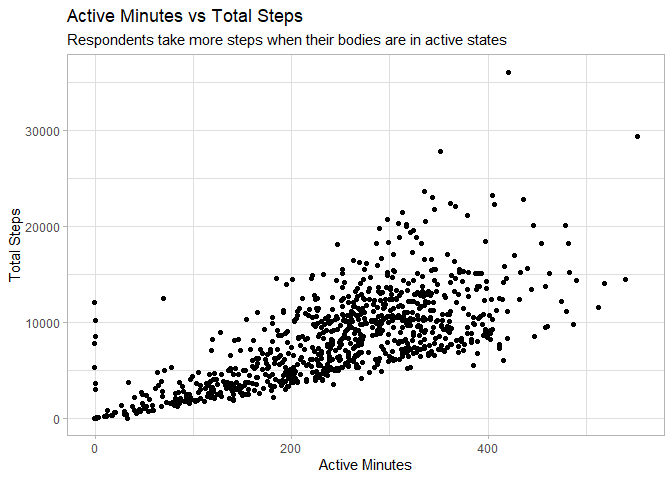

Bellabeat Case Study
================
Blessing Ideh
2022-10-16

#### **Loading the necessary packages**

``` r
library(tidyverse)
```

    ## ── Attaching packages ─────────────────────────────────────── tidyverse 1.3.2 ──
    ## ✔ ggplot2 3.3.6      ✔ purrr   0.3.4 
    ## ✔ tibble  3.1.8      ✔ dplyr   1.0.10
    ## ✔ tidyr   1.2.1      ✔ stringr 1.4.1 
    ## ✔ readr   2.1.2      ✔ forcats 0.5.2 
    ## ── Conflicts ────────────────────────────────────────── tidyverse_conflicts() ──
    ## ✖ dplyr::filter() masks stats::filter()
    ## ✖ dplyr::lag()    masks stats::lag()

``` r
library(lubridate)
```

    ## 
    ## Attaching package: 'lubridate'
    ## 
    ## The following objects are masked from 'package:base':
    ## 
    ##     date, intersect, setdiff, union

``` r
library(scales)
```

    ## 
    ## Attaching package: 'scales'
    ## 
    ## The following object is masked from 'package:purrr':
    ## 
    ##     discard
    ## 
    ## The following object is masked from 'package:readr':
    ## 
    ##     col_factor

#### **Importing files**

``` r
daily_activity <-  read.csv("dailyActivity_merged.csv")
daily_steps <-  read.csv("dailySteps_merged.csv")
hourly_steps <- read.csv("hourlySteps_merged.csv")
sleep_day <- read.csv("sleepDay_merged.csv")
```

#### **Viewing the data**

``` r
str(daily_activity)
```

    ## 'data.frame':    940 obs. of  15 variables:
    ##  $ Id                      : num  6.96e+09 6.96e+09 4.02e+09 8.88e+09 8.88e+09 ...
    ##  $ ActivityDate            : chr  "4/21/2016" "4/25/2016" "05/05/2016" "05/09/2016" ...
    ##  $ TotalSteps              : int  11835 13239 11728 20226 18258 4496 5546 7671 6116 5565 ...
    ##  $ TotalDistance           : num  9.71 9.27 8.43 18.25 16.31 ...
    ##  $ TrackerDistance         : num  7.88 9.08 8.43 18.25 16.31 ...
    ##  $ LoggedActivitiesDistance: num  4.08 2.79 0 0 0 ...
    ##  $ VeryActiveDistance      : num  3.99 3.02 2.62 11.1 10.23 ...
    ##  $ ModeratelyActiveDistance: num  2.1 1.68 1.68 0.8 0.03 ...
    ##  $ LightActiveDistance     : num  3.51 4.46 4.04 6.24 5.97 ...
    ##  $ SedentaryActiveDistance : num  0.11 0.1 0.07 0.05 0.05 ...
    ##  $ VeryActiveMinutes       : int  53 35 38 73 61 0 0 0 0 0 ...
    ##  $ FairlyActiveMinutes     : int  27 31 42 19 2 0 0 0 0 0 ...
    ##  $ LightlyActiveMinutes    : int  214 282 196 217 236 174 206 363 305 287 ...
    ##  $ SedentaryMinutes        : int  708 637 916 1131 1141 950 774 1077 1135 1153 ...
    ##  $ Calories                : int  2179 2194 3429 3710 3427 2828 2926 2952 2806 2743 ...

``` r
head(daily_activity)
```

    ##           Id ActivityDate TotalSteps TotalDistance TrackerDistance
    ## 1 6962181067    4/21/2016      11835          9.71            7.88
    ## 2 6962181067    4/25/2016      13239          9.27            9.08
    ## 3 4020332650   05/05/2016      11728          8.43            8.43
    ## 4 8877689391   05/09/2016      20226         18.25           18.25
    ## 5 8877689391    4/22/2016      18258         16.31           16.31
    ## 6 4020332650   05/03/2016       4496          3.22            3.22
    ##   LoggedActivitiesDistance VeryActiveDistance ModeratelyActiveDistance
    ## 1                 4.081692               3.99                     2.10
    ## 2                 2.785175               3.02                     1.68
    ## 3                 0.000000               2.62                     1.68
    ## 4                 0.000000              11.10                     0.80
    ## 5                 0.000000              10.23                     0.03
    ## 6                 0.000000               0.00                     0.00
    ##   LightActiveDistance SedentaryActiveDistance VeryActiveMinutes
    ## 1                3.51                    0.11                53
    ## 2                4.46                    0.10                35
    ## 3                4.04                    0.07                38
    ## 4                6.24                    0.05                73
    ## 5                5.97                    0.05                61
    ## 6                3.15                    0.05                 0
    ##   FairlyActiveMinutes LightlyActiveMinutes SedentaryMinutes Calories
    ## 1                  27                  214              708     2179
    ## 2                  31                  282              637     2194
    ## 3                  42                  196              916     3429
    ## 4                  19                  217             1131     3710
    ## 5                   2                  236             1141     3427
    ## 6                   0                  174              950     2828

``` r
str(sleep_day)
```

    ## 'data.frame':    413 obs. of  5 variables:
    ##  $ Id                : num  1.5e+09 1.5e+09 1.5e+09 1.5e+09 1.5e+09 ...
    ##  $ SleepDay          : chr  "4/12/2016 12:00:00 AM" "4/13/2016 12:00:00 AM" "4/15/2016 12:00:00 AM" "4/16/2016 12:00:00 AM" ...
    ##  $ TotalSleepRecords : int  1 2 1 2 1 1 1 1 1 1 ...
    ##  $ TotalMinutesAsleep: int  327 384 412 340 700 304 360 325 361 430 ...
    ##  $ TotalTimeInBed    : int  346 407 442 367 712 320 377 364 384 449 ...

``` r
head(sleep_day)
```

    ##           Id              SleepDay TotalSleepRecords TotalMinutesAsleep
    ## 1 1503960366 4/12/2016 12:00:00 AM                 1                327
    ## 2 1503960366 4/13/2016 12:00:00 AM                 2                384
    ## 3 1503960366 4/15/2016 12:00:00 AM                 1                412
    ## 4 1503960366 4/16/2016 12:00:00 AM                 2                340
    ## 5 1503960366 4/17/2016 12:00:00 AM                 1                700
    ## 6 1503960366 4/19/2016 12:00:00 AM                 1                304
    ##   TotalTimeInBed
    ## 1            346
    ## 2            407
    ## 3            442
    ## 4            367
    ## 5            712
    ## 6            320

## **Data Cleaning and Transformation**

##### The data is cleaned and transformed by employing different methods to ensure that the data is cleaned, consistent and ready for analysis. Inconsistences are removed, data types are checked to confirmed that they are of the right type and errors, where present dealth with.

#### **Converting date columns from string to date data type**

``` r
# The date columns in the data are of the character data type. They are subsequently converted to the date data type.

daily_activity <- mutate(daily_activity, ActivityDate = as.Date(daily_activity$ActivityDate, format = "%m/%d/%Y"))
daily_steps <- mutate(daily_steps, ActivityDay = mdy(daily_steps$ActivityDay))
hourly_steps <- mutate(hourly_steps, ActivityHour = format(mdy_hms(as.character(ActivityHour, tz = "UTC")), "%H:%S"))
sleep_day <- mutate(sleep_day, SleepDay = as.Date(sleep_day$SleepDay, format = "%m/%d/%Y"))
```

``` r
# Confirming if they are converted correctly
class(daily_activity$ActivityDate)
```

    ## [1] "Date"

``` r
class(daily_steps$ActivityDay)
```

    ## [1] "Date"

#### **Renaming Columns**

``` r
# The date columns are renamed to "Date" and "Hour" for consistency and readability

daily_activity <-  rename(daily_activity, Date = ActivityDate)
daily_steps <-  rename(daily_steps, Date = ActivityDay)
hourly_steps <-  rename(hourly_steps, Time = ActivityHour)
sleep_day <-  rename(sleep_day, Date = SleepDay)
```

## **Data Analysis**

##### **Checking for the number of respondents in each data**

``` r
# To check for the number of respondents in each data set by counting distinct IDs

n_distinct(daily_activity$Id)
```

    ## [1] 33

``` r
n_distinct(sleep_day$Id)
```

    ## [1] 24

``` r
n_distinct(daily_steps$Id)
```

    ## [1] 33

``` r
n_distinct(hourly_steps$Id)
```

    ## [1] 33

#### **Summary statistics of the sleep data**

``` r
sleep_day %>%
  select(TotalSleepRecords,
         TotalMinutesAsleep,
         TotalTimeInBed) %>%
  summary()
```

    ##  TotalSleepRecords TotalMinutesAsleep TotalTimeInBed 
    ##  Min.   :1.000     Min.   : 58.0      Min.   : 61.0  
    ##  1st Qu.:1.000     1st Qu.:361.0      1st Qu.:403.0  
    ##  Median :1.000     Median :433.0      Median :463.0  
    ##  Mean   :1.119     Mean   :419.5      Mean   :458.6  
    ##  3rd Qu.:1.000     3rd Qu.:490.0      3rd Qu.:526.0  
    ##  Max.   :3.000     Max.   :796.0      Max.   :961.0

#### **Analyzing the difference between total time in bed and total time asleep**

``` r
#  Inserting a new column, Difference to compute the difference between total time in bed and total time asleep in the sleep_day data
sleep_day <- mutate(sleep_day, Difference = TotalTimeInBed - TotalMinutesAsleep)
```

``` r
# Arranging by descending order to view the values on the higher end

head(sleep_day %>% 
  arrange(desc(Difference)))
```

    ##           Id       Date TotalSleepRecords TotalMinutesAsleep TotalTimeInBed
    ## 1 1844505072 2016-05-01                 1                590            961
    ## 2 1844505072 2016-04-15                 1                644            961
    ## 3 3977333714 2016-05-01                 1                383            626
    ## 4 1844505072 2016-04-30                 1                722            961
    ## 5 3977333714 2016-04-16                 1                283            510
    ## 6 3977333714 2016-04-24                 1                310            526
    ##   Difference
    ## 1        371
    ## 2        317
    ## 3        243
    ## 4        239
    ## 5        227
    ## 6        216

``` r
# Arranging by ascending order to view the values on the lower end

head(sleep_day %>% 
  arrange(Difference))
```

    ##           Id       Date TotalSleepRecords TotalMinutesAsleep TotalTimeInBed
    ## 1 4020332650 2016-04-16                 1                 77             77
    ## 2 7086361926 2016-04-25                 1                446            447
    ## 3 8053475328 2016-05-07                 1                 74             75
    ## 4 4445114986 2016-04-29                 1                106            108
    ## 5 6962181067 2016-04-30                 1                422            424
    ## 6 4388161847 2016-04-22                 1                 82             85
    ##   Difference
    ## 1          0
    ## 2          1
    ## 3          1
    ## 4          2
    ## 5          2
    ## 6          3

#### **Counting and displaying rows where the difference is greater than or equal to 30 minutes**

``` r
# Displaying differences greater than or equal to 30 minutes

head(sleep_day %>% 
       filter(Difference >= 30))
```

    ##           Id       Date TotalSleepRecords TotalMinutesAsleep TotalTimeInBed
    ## 1 1503960366 2016-04-15                 1                412            442
    ## 2 1503960366 2016-04-21                 1                325            364
    ## 3 1503960366 2016-04-25                 1                277            323
    ## 4 1503960366 2016-05-02                 1                277            309
    ## 5 1503960366 2016-05-06                 1                334            367
    ## 6 1644430081 2016-05-02                 1                796            961
    ##   Difference
    ## 1         30
    ## 2         39
    ## 3         46
    ## 4         32
    ## 5         33
    ## 6        165

``` r
# Counting differences greater than or equal to 30 minutes

sleep_day %>%
  summarise(sum(Difference >= 30))
```

    ##   sum(Difference >= 30)
    ## 1                   171

#### **Counting and displaying rows where the difference is less than 30 minutes**

``` r
# Displaying differences lesser than 30 minutes

head(sleep_day %>%
       filter(Difference < 30))
```

    ##           Id       Date TotalSleepRecords TotalMinutesAsleep TotalTimeInBed
    ## 1 1503960366 2016-04-12                 1                327            346
    ## 2 1503960366 2016-04-13                 2                384            407
    ## 3 1503960366 2016-04-16                 2                340            367
    ## 4 1503960366 2016-04-17                 1                700            712
    ## 5 1503960366 2016-04-19                 1                304            320
    ## 6 1503960366 2016-04-20                 1                360            377
    ##   Difference
    ## 1         19
    ## 2         23
    ## 3         27
    ## 4         12
    ## 5         16
    ## 6         17

``` r
# Counting differences lesser than 30 minutes
sleep_day %>%
  summarise(sum(Difference < 30))
```

    ##   sum(Difference < 30)
    ## 1                  242

#### **Calculating the percentage**

``` r
more_than_or_equal_to_30 <- 171 /413
less_than_30 <-  242 /413

# Rounding to 2 decimal places
percent(more_than_or_equal_to_30, accuracy = 1)
```

    ## [1] "41%"

``` r
percent(less_than_30, accuracy = 1)
```

    ## [1] "59%"

##### This can be visualized in a graph that shows the difference in respondents that spend more than or exactly 30 minutes before sleeping against those who spend less than 30 minutes before falling.

#### **What time of the day are steps taken higher?**

``` r
head(hourly_steps %>%
  group_by(Time) %>%
  summarise(sum(StepTotal)),13)
```

    ## # A tibble: 13 × 2
    ##    Time  `sum(StepTotal)`
    ##    <chr>            <int>
    ##  1 00:00            39404
    ##  2 01:00            21555
    ##  3 02:00            15964
    ##  4 03:00             5996
    ##  5 04:00            11836
    ##  6 05:00            40886
    ##  7 06:00           166191
    ##  8 07:00           284932
    ##  9 08:00           398044
    ## 10 09:00           403404
    ## 11 10:00           447467
    ## 12 11:00           423534
    ## 13 12:00           505848

### **Are respondents meeting the recommended 10,000 steps daily**

#### **Checking for entries where steps are more than or equal to 10,000**

``` r
head(daily_activity %>%
  select(Id,Date, TotalSteps, Calories) %>% 
  group_by(Id) %>% 
  filter(TotalSteps >= 10000),10)
```

    ## # A tibble: 10 × 4
    ## # Groups:   Id [5]
    ##            Id Date       TotalSteps Calories
    ##         <dbl> <date>          <int>    <int>
    ##  1 6962181067 2016-04-21      11835     2179
    ##  2 6962181067 2016-04-25      13239     2194
    ##  3 4020332650 2016-05-05      11728     3429
    ##  4 8877689391 2016-05-09      20226     3710
    ##  5 8877689391 2016-04-22      18258     3427
    ##  6 8877689391 2016-04-14      21129     3793
    ##  7 7007744171 2016-04-18      14816     2832
    ##  8 1624580081 2016-05-01      36019     2690
    ##  9 8877689391 2016-04-15      13422     3934
    ## 10 8877689391 2016-04-23      11200     3891

#### **Checking for entries where steps are less than 10,000**

``` r
head(daily_activity %>% 
  select(Id,Date, TotalSteps) %>% 
  filter(TotalSteps < 10000), 10)
```

    ##            Id       Date TotalSteps
    ## 1  4020332650 2016-05-03       4496
    ## 2  4020332650 2016-05-10       5546
    ## 3  6290855005 2016-04-14       7671
    ## 4  6290855005 2016-05-06       6116
    ## 5  6290855005 2016-04-27       5565
    ## 6  3372868164 2016-04-16       6905
    ## 7  1644430081 2016-05-06       9787
    ## 8  6290855005 2016-05-01       9837
    ## 9  6290855005 2016-04-18       6885
    ## 10 6290855005 2016-05-02       6781

### **Are respondents meeting the average 8 hours of sleep daily?**

#### **Checking the time period in the data**

``` r
range(sleep_day$Date)
```

    ## [1] "2016-04-12" "2016-05-12"

#### **Viewing the no of respondents, days and total entries in the data**

``` r
n_distinct(sleep_day$Id)
```

    ## [1] 24

``` r
n_distinct(sleep_day$Date)
```

    ## [1] 31

``` r
n_distinct(sleep_day)
```

    ## [1] 410

#### **Number of hours respondents sleep daily**

``` r
# Inserting a new column, HoursSlept to show how many hours respondents are sleeping
sleep_day <- mutate(sleep_day, HoursSlept = round(TotalMinutesAsleep/60))
head(sleep_day)
```

    ##           Id       Date TotalSleepRecords TotalMinutesAsleep TotalTimeInBed
    ## 1 1503960366 2016-04-12                 1                327            346
    ## 2 1503960366 2016-04-13                 2                384            407
    ## 3 1503960366 2016-04-15                 1                412            442
    ## 4 1503960366 2016-04-16                 2                340            367
    ## 5 1503960366 2016-04-17                 1                700            712
    ## 6 1503960366 2016-04-19                 1                304            320
    ##   Difference HoursSlept
    ## 1         19          5
    ## 2         23          6
    ## 3         30          7
    ## 4         27          6
    ## 5         12         12
    ## 6         16          5

#### **Checking for Respondents who sleep exactly or more than 8 hours daily**

``` r
by_id <- sleep_day %>%
  group_by(Id) %>%
  filter(HoursSlept >= 8) 

head(by_id,10)
```

    ## # A tibble: 10 × 7
    ## # Groups:   Id [5]
    ##            Id Date       TotalSleepRecords TotalMinute…¹ Total…² Diffe…³ Hours…⁴
    ##         <dbl> <date>                 <int>         <int>   <int>   <int>   <dbl>
    ##  1 1503960366 2016-04-17                 1           700     712      12      12
    ##  2 1503960366 2016-05-08                 1           594     611      17      10
    ##  3 1644430081 2016-05-02                 1           796     961     165      13
    ##  4 1844505072 2016-04-15                 1           644     961     317      11
    ##  5 1844505072 2016-04-30                 1           722     961     239      12
    ##  6 1844505072 2016-05-01                 1           590     961     371      10
    ##  7 1927972279 2016-04-12                 3           750     775      25      12
    ##  8 1927972279 2016-04-15                 2           475     499      24       8
    ##  9 2026352035 2016-04-12                 1           503     546      43       8
    ## 10 2026352035 2016-04-13                 1           531     565      34       9
    ## # … with abbreviated variable names ¹​TotalMinutesAsleep, ²​TotalTimeInBed,
    ## #   ³​Difference, ⁴​HoursSlept

``` r
# Calculating the sum of sleep on days when respondents slept more than 8 hours and grouping by Id
sleep_hours <- sleep_day %>%
  group_by(Id) %>%
  summarise(Days_sleepHours_more_than_or_8 = sum(HoursSlept >= 8)) 
  
head(sleep_hours)
```

    ## # A tibble: 6 × 2
    ##           Id Days_sleepHours_more_than_or_8
    ##        <dbl>                          <int>
    ## 1 1503960366                              2
    ## 2 1644430081                              1
    ## 3 1844505072                              3
    ## 4 1927972279                              2
    ## 5 2026352035                             26
    ## 6 2320127002                              0

##### **How many respondents sleep more than 8 hours of the entire time period**

``` r
# Filtering
sleep_hours %>%
  select(Id,Days_sleepHours_more_than_or_8) %>% 
  filter(Days_sleepHours_more_than_or_8 >= 15)
```

    ## # A tibble: 2 × 2
    ##           Id Days_sleepHours_more_than_or_8
    ##        <dbl>                          <int>
    ## 1 2026352035                             26
    ## 2 4319703577                             23

### **Summary statistics of the Activity data**

##### The minutes are grouped into two, active and sedentary with the active grouped even further into very active, fairly active and lightly active minutes showing different level of intensities.

``` r
# Summary statistics of the minutes
daily_activity %>%
  select(VeryActiveMinutes,
         FairlyActiveMinutes,
         LightlyActiveMinutes,
         SedentaryMinutes) %>%
  summary()
```

    ##  VeryActiveMinutes FairlyActiveMinutes LightlyActiveMinutes SedentaryMinutes
    ##  Min.   :  0.00    Min.   :  0.00      Min.   :  0.0        Min.   :   0.0  
    ##  1st Qu.:  0.00    1st Qu.:  0.00      1st Qu.:127.0        1st Qu.: 729.8  
    ##  Median :  4.00    Median :  6.00      Median :199.0        Median :1057.5  
    ##  Mean   : 21.16    Mean   : 13.56      Mean   :192.8        Mean   : 991.2  
    ##  3rd Qu.: 32.00    3rd Qu.: 19.00      3rd Qu.:264.0        3rd Qu.:1229.5  
    ##  Max.   :210.00    Max.   :143.00      Max.   :518.0        Max.   :1440.0

#### **Creating a new column, Active minutes to combine the total, fairly and lightly active minutes together**

``` r
daily_activity <-  mutate(daily_activity, ActiveMinutes = VeryActiveMinutes + FairlyActiveMinutes + LightlyActiveMinutes)
```

### **Summary statistics of Active and Sedentary minutes**

``` r
daily_activity %>%
  select(SedentaryMinutes,ActiveMinutes) %>%
  summary()
```

    ##  SedentaryMinutes ActiveMinutes  
    ##  Min.   :   0.0   Min.   :  0.0  
    ##  1st Qu.: 729.8   1st Qu.:146.8  
    ##  Median :1057.5   Median :247.0  
    ##  Mean   : 991.2   Mean   :227.5  
    ##  3rd Qu.:1229.5   3rd Qu.:317.2  
    ##  Max.   :1440.0   Max.   :552.0

## **Visualization**

### **Comparison of Total time in bed and total time asleep**

``` r
ggplot(sleep_day, aes(y = TotalTimeInBed, x = TotalMinutesAsleep)) + 
  geom_jitter() + labs(x= "Time Asleep (mins)", y = "Total Time in bed (mins)",
                                     title = "Relationship between time in bed and time asleep",
                       subtitle =  "Are respondents falling asleep as soon as they they hit the sack?") + 
  theme_light()
```

<!-- -->

### **Difference between total time in bed and total time asleep**

``` r
ggplot(sleep_day) +
  geom_bar(aes(y = Difference >= 30), fill = "darkslateblue") +
  theme(panel.grid.major = element_blank(), panel.grid.minor = element_blank()) + guides(fill = "none")  +
  labs(y = "Conditions",x  ="Difference between time in bed and time asleep (mins)",
       title = "Difference between total time in bed and total time asleep",
       subtitle = "True if respondents spend 30 or more minutes before falling asleep, false if they spend less") +
  theme_minimal()
```

<!-- -->

### **Visualizing the most busy hours by steps taken**

``` r
ggplot(data= hourly_steps, aes(x= StepTotal, y = Time )) +
  geom_jitter() + labs(x = "Total steps taken", title = "Most Busy Hours of the Day",
                       subtitle = "What  time of the day are steps taken higher?") +
  theme_light()
```

<!-- -->

### **Minutes Intensity**

``` r
Intensity <- daily_activity %>%
  pivot_longer(cols = c("VeryActiveMinutes", "LightlyActiveMinutes", "FairlyActiveMinutes", "SedentaryMinutes"),
               names_to = "Intensities", values_to = "Count")

ggplot(Intensity) +
  geom_bar(aes(x = Count, y = (reorder(Intensities, Count))), fill = "darkslateblue", stat = "Identity") +
  labs(x = "Sum of minutes", y = "Minute type", title = "Intensities",
       subtitle = "Classsification of minutes by how intense, the activities respondents engage in are.") + 
  theme_minimal() + theme(plot.title = element_text(size = 23, color = "black")) +
  scale_y_discrete(labels = c("Fairly Active", "Lightly Active", "Very Active", "Sedentary")) +
  theme(panel.grid.major.x = element_line(size = .1, color = "azure4"))
```

<!-- -->

### **Breakdown of how time spent is spent by activity intensities**

#### **Sedentary Minutes vs Total Steps**

``` r
ggplot(daily_activity, aes(SedentaryMinutes, TotalSteps)) + 
  geom_jitter() +
  labs(x= "Sedentary Minutes", y = "Total Steps",title = "Sedentary Minutes vs Total Steps",
       subtitle = "Respondents take lesser steps when they're inactive") + theme_light()
```

<!-- -->

#### **Active Minutes vs Total Steps**

``` r
ggplot(daily_activity, aes(ActiveMinutes, TotalSteps)) + 
  geom_jitter() +
  labs(x= "Active Minutes", y = "Total Steps",title = "Active Minutes vs Total Steps",
       subtitle = "Respondents take more steps when their bodies are in active states") + theme_light()
```

<!-- -->

### **Findings**

##### 1. A total of 33 respondents were surveyed for the smart watch analysis, although only 24 responded to the sleep_data survey.

##### 2. The difference in Total time asleeep and total time in bed were quite large. The number of days when respondents took longer than 30 minutes to fall asleep after getting into bed was 171, 41% of the total while the respondents who slept less than 30 minutes after hitting the bed was 242, 59%.

##### 3. Out of the 31 days period during which the sleep data was recoreded, only 2 out of 24 respondents slept exactly 8 or more hours for 15 or more days consistently. 15 days was used as the benchmark because the time period in the data was 31 days.

##### 4. The busiest hours evidenced by steps taken are between 8:00am and 9:00pm, with the peak hours in the afternoon.

##### 5. The data on the heart rate and weight data only contained information from 8 respondents, a small sample size and was therefore excluded from the analysis to eliminate bias.

##### 6. Respondents spend a lot of time in bed not sleeeping and a large no of them are sleeping for less than 8 hours, the average recommended sleep hours.

##### 7. of 940 entries, 637 entries recorded less than 10K steps walked while 303 entries noted \>=10K steps

### **Trends**

##### 1. Smart devices record more steps taken between 8:00am and 9:00pm.

##### 2. 171 out of 413 days, smart watches recorded that users slept for exactly 8 or more hours.

##### 3. from the weight data and heartrate data, it seems participants have a hard recording said data.

### **Recommendations**

##### I. Bellabeat could program their app to encourage users to take more walks to

##### II.The app should come with an alarm system that notify users when to sleep.

##### III. The alarm system should also be programmed to prompt or encourage users to eengage in more mobile activities.
